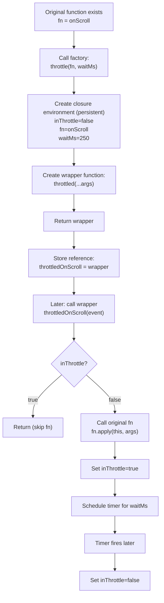

```javascript
function debounce(fn, waitMs) {
  let timerId;

  return function debounced(...args) {
    clearTimeout(timerId);
    timerId = setTimeout(() => fn.apply(this, args), waitMs);
  };
}

function throttle(fn, waitMs) {
  let inThrottle = false;

  return function throttled(...args) {
    if (inThrottle) return;

    fn.apply(this, args);
    inThrottle = true;

    setTimeout(() => {
      inThrottle = false;
    }, waitMs);
  };
}

function memoize(fn) {
  const cache = new Map();

  return function memoized(arg) {
    if (cache.has(arg)) return cache.get(arg);
    const result = fn.call(this, arg);
    cache.set(arg, result);
    return result;
  };
}
```

---

## Mental model: “function factory” + closure (why the returned functions work)

These are higher-order functions because they **accept a function** and **return a new function** (a wrapper).

### Factory setup vs wrapper runtime

- **Setup (factory call)**: calling `debounce(fn, waitMs)`, `throttle(fn, waitMs)`, or `memoize(fn)` runs **once** and returns a wrapper function.
- **Runtime (wrapper calls)**: calling the returned wrapper function runs **many times** later.
- **Closure**: the returned wrapper “remembers” the variables created during setup (`timerId`, `inThrottle`, `cache`, plus references to `fn`, `waitMs`). That’s how state persists across wrapper calls.

### `(...args)` vs `(arg)`

- **`(...args)`** in `debounce`/`throttle`
  - The wrapper accepts **any number of arguments**.
  - It forwards them to `fn` unchanged using `fn.apply(this, args)`.
  - Result: the wrapper can wrap *almost any* function signature (events, multiple parameters, etc.).

- **`(arg)`** in `memoize`
  - The wrapper is intentionally **unary**: it uses the first argument as the **cache key** and only passes that one value to `fn` via `fn.call(this, arg)`.
  - If you call `memoized(a, b)`, `b` is ignored by this implementation.

---

## Process flow map: `throttle`

### 1) Define a function you want to throttle

You start with an “original” function value, e.g. `onScroll`.

### 2) Call the factory to create a new wrapper

`const throttledOnScroll = throttle(onScroll, 250)`

When `throttle(onScroll, 250)` runs:

- It creates **persistent state**: `inThrottle = false`
- It stores references to: `fn = onScroll`, `waitMs = 250`
- It creates and **returns** the wrapper function `throttled(...args)`
- The returned wrapper + its remembered state is a **closure**

### 3) Call the returned wrapper many times later

When something calls `throttledOnScroll(event)`:

- The wrapper reads `inThrottle`
  - If `true`: return immediately (don’t call `fn`)
  - If `false`: call `fn.apply(this, args)`, set `inThrottle = true`
- It schedules a timer so after `waitMs`, `inThrottle` flips back to `false`

### Flow diagram (factory + closure + wrapper calls)



---

## Metaphor: bouncer + performer

- **`fn`** is the performer (the work you *want* to run).
- Calling **`throttle(fn, 250)`** hires a **bouncer** and gives them a rule: “only let the performer through once every 250ms.”
- The returned function is the **bouncer**.
- The bouncer’s private sticky note is **`inThrottle`** (the closure state).

So: the factory builds a bouncer with private memory; the wrapper calls consult/update that memory and decide whether to forward the call to `fn`.


## Throttle “call map” (mental model)

I’ll use your `throttle`:

```14:26:functions/higher-order-function-composition.md
function throttle(fn, waitMs) {
  let inThrottle = false;

  return function throttled(...args) {
    if (inThrottle) return;

    fn.apply(this, args);
    inThrottle = true;

    setTimeout(() => {
      inThrottle = false;
    }, waitMs);
  };
}
```

## Step-by-step: defining `throttle` (what exists before any calls)

- **When the file is loaded**, JS creates one function object named **`throttle`**.
- Nothing inside it runs yet. No `inThrottle` exists yet. No `throttled` exists yet.

---

## Step-by-step: creating the wrapper closure (calling `throttle`)

Example usage:

```js
function onScroll(e) { console.log("scroll", e.type); }

const throttledOnScroll = throttle(onScroll, 250);
```

Here’s the “map” of what happens:

### 1) Call `throttle(onScroll, 250)`
- **Call stack:** `throttle(...)`
- JS creates a new **call frame** for `throttle`.
- In that frame:
  - `fn` → references the function object `onScroll`
  - `waitMs` → `250`
  - `inThrottle` is created and set to `false`

### 2) Create and return the inner function
- `return function throttled(...args) { ... }` creates a **new function object** (the wrapper).
- Crucial: that wrapper function is created with a hidden link to the variables in the `throttle` call frame (`fn`, `waitMs`, and especially `inThrottle`).  
  That hidden link is the **closure**.

### 3) Assign the returned wrapper to your variable
- `throttledOnScroll` now points to the returned function (`throttled`).
- The original `throttle(...)` call frame is popped off the stack **but** its variables are kept alive because the returned function still references them (closure).

So after setup you have:

- `throttledOnScroll` → wrapper function `throttled`
- inside `throttled`’s closure:
  - `fn` → `onScroll`
  - `waitMs` → `250`
  - `inThrottle` → `false` (mutable, persists across calls)

---

## Step-by-step: calling the returned function (what happens per event)

Imagine the browser calls your handler a bunch of times:

```js
throttledOnScroll(event1);
throttledOnScroll(event2);
```

### Call A: `throttledOnScroll(event1)`
- **Call stack:** `throttled(...)`
- `...args` becomes `[event1]`
- checks `if (inThrottle) return;` → currently `false`, so continue
- calls `fn.apply(this, args)` → calls `onScroll(event1)` (same args; `this` forwarded)
  - **Nested call stack moment:** `throttled(...)` → `onScroll(...)`
  - `onScroll` runs, returns
- sets `inThrottle = true`
- schedules a timer: after `waitMs`, run `() => { inThrottle = false }`
- wrapper returns

**State after Call A ends (stored in closure):**
- `inThrottle` is now `true`

### Call B: `throttledOnScroll(event2)` (soon after)
- **Call stack:** `throttled(...)`
- `args` becomes `[event2]`
- checks `if (inThrottle) return;` → now `true`, so it returns immediately
- `onScroll` is **not called**

### Later: timer fires
- **Call stack (later, separate):** the timer callback `() => { inThrottle = false }`
- It runs and flips the same closed-over `inThrottle` back to `false`

---

## The key “function passing” picture

- You pass **a function value** (`onScroll`) *into* `throttle`.
- `throttle` returns **a new function value** (the wrapper).
- You store that returned function in a variable (`throttledOnScroll`).
- Later, someone calls `throttledOnScroll(...)`.
- That wrapper uses its closure to find:
  - which original function to call (`fn`)
  - whether it’s allowed right now (`inThrottle`)
  - how long to lock out (`waitMs`)

If you want, I can draw the same map but with explicit “stack frames” for one call (wrapper → original fn → return) plus the separate timer callback frame.