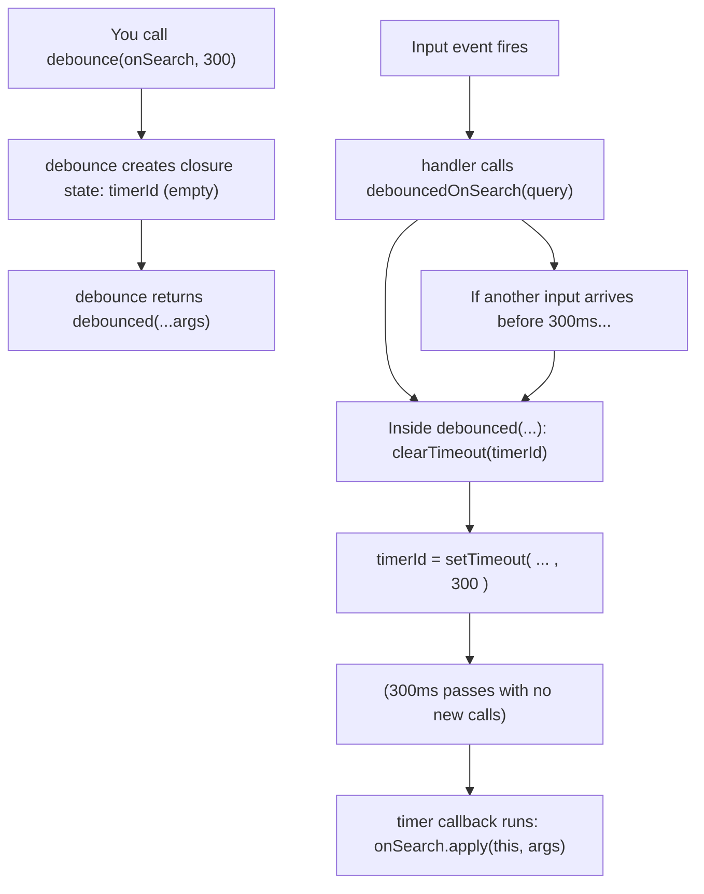

How do you implement `debounce` from scratch (basic → web use case → medium/complex)?
?

`debounce` makes a function wait until a burst of calls **stops**.

- `debounce`: “run after the user stops doing the thing”
- common uses: search-as-you-type, autosave, window resize recalcs

## Basic `debounce` key components (what matters)

| Piece | Where it lives | What it’s responsible for |
| --- | --- | --- |
| **Closure state (`timerId`)** | inside `debounce`, outside the returned function | Stores the *current* timer so every call shares the same “pending work” slot. |
| **Returned wrapper function (`debounced`)** | the function you get back from `debounce(...)` | This is what you call repeatedly; it decides when (or if) to run the original `fn`. |
| **Cancel previous work (`clearTimeout`)** | at the start of each `debounced(...)` call | Stops the previously scheduled run so only the latest call in a burst can win. |
| **Schedule the trailing run (`setTimeout`)** | after canceling, within `debounced(...)` | Creates a new timer for `waitMs` that will eventually call `fn`. |
| **Forward `this` + args (`fn.apply(this, args)`)** | inside the timer callback | Preserves the caller’s `this` and forwards arguments so debouncing methods still works. |
| **Trailing-edge behavior** | an effect of “call inside `setTimeout`” | `fn` runs **after** the last call, not immediately on the first call. |

---

## Basic `debounce` from scratch (trailing edge)

This is the simplest useful form: it only runs on the **trailing edge** (after the last call).

```js
function debounce(fn, waitMs) {
  let timerId;

  return function debounced(...args) {
    clearTimeout(timerId);
    timerId = setTimeout(() => fn.apply(this, args), waitMs);
  };
}
```

Key idea: each call cancels the previous timer and schedules a new one.

### `setTimeout` / `clearTimeout` notes (what’s the “timer”?)

- **`setTimeout(callback, delayMs)`**: schedules `callback` to run **later** (after at least `delayMs` milliseconds).
  - It returns a **timer handle** (often called `timerId`): a reference to *that scheduled run*, a number ID.
  - In debounce, `delayMs` is your debouncing delay (`waitMs`).

- **`clearTimeout(timerId)`**: cancels the scheduled timeout referenced by `timerId` (if it hasn’t fired yet).
  - This is why only the *last* call in a burst can win: each new call cancels the previous scheduled run before scheduling a new one.
  - It’s effectively safe if `timerId` is empty/undefined (the first call has nothing to cancel).


These two are equivalent:

```js
setTimeout(resolve, 1000, "bar");
setTimeout(() => resolve("bar"), 1000);
```

---

## Walkthrough + simple web app use case (search input)

Imagine a tiny page with:

```html
<input id="q" placeholder="Search..." />
<pre id="out"></pre>
```

You want to call the API only when the user pauses typing for 300ms.

```js
function render(text) {
  document.querySelector("#out").textContent = text;
}

async function fetchResults(query) {
  // demo stub (pretend network)
  await new Promise(r => setTimeout(r, 150));
  return ["apple", "apricot", "avocado"].filter(x => x.includes(query));
}

async function onSearch(query) {
  const results = await fetchResults(query);
  render(JSON.stringify({ query, results }, null, 2));
}

const debouncedOnSearch = debounce(onSearch, 300);

document.querySelector("#q").addEventListener("input", (e) => {
  const query = e.target.value.trim();
  if (query.length < 2) return render("Type 2+ chars…");
  debouncedOnSearch(query);
});
```

### Flow diagram: how the returned function fits in

You can read `debounce(onSearch, 300)` as: “build me a new function that *controls when* `onSearch` is allowed to run”.

In other words:

- `onSearch` is the **work function** (what you *eventually* want to happen)
- `debouncedOnSearch` is the **gatekeeper function** (what you call *every time* the event fires)
- the gatekeeper holds onto shared state (the timer) so it can decide when the work is allowed to actually run



### Linear timeline: how each call cancels/reschedules

Example with `waitMs = 300` and quick typing events at \(t = 0, 80, 140\) for `c → ca → cat`:

```text
time (ms):   0        80       140                 440
             |--------|--------|-------------------|
input:       "c"      "ca"     "cat"

schedule:    onSearch("c")   (cancelled)
             └─ would run at t=300

             onSearch("ca")  (cancelled)
                      └─ would run at t=380

             onSearch("cat") (kept)
                              └─ runs at t=440 (140 + 300)
```

### What happens when you type “cat” quickly?

Calls arrive like: `c` → `ca` → `cat`

- **Type `c`**: schedule `onSearch("c")` for \(t + 300ms\)
- **Type `a`**: cancel the previous schedule, schedule `onSearch("ca")`
- **Type `t`**: cancel again, schedule `onSearch("cat")`
- **Stop typing**: after 300ms, only the **last** call executes

---

## Extending the basic `debounce`: what the “advanced” features are for (no code)

The basic version answers: “**only run after the user stops**.”

The more feature-rich versions exist because real UIs often need more control than *just* trailing-edge scheduling.

### Feature summary + when it’s useful

- **`leading` (run immediately at the start of a burst)**: gives instant feedback on the first interaction, then suppresses the spammy middle calls.
  - **Useful when**: you want the UI to react right away, but still avoid repeated work (e.g., show a “preview loading…” state immediately, then fetch once at the end).

- **`trailing` (run after the burst ends)**: what the basic debounce already does.
  - **Useful when**: correctness depends on the *final* input value (search query, final window size, last keystroke).

- **`maxWait` (guarantee it runs at least every N ms even if calls keep coming)**: prevents “never runs” when the burst *doesn’t end*.
  - **Useful when**: the user can keep producing events continuously (scroll/resize/drag), but you still must do periodic work (autosave, analytics heartbeat, incremental layout/position recalculation).

- **`.cancel()` (drop pending work)**: lets you explicitly say “whatever was scheduled, don’t do it.”
  - **Useful when**: the work is no longer relevant (component unmounts, user navigates away, the input is cleared, a request is superseded by a new mode).

- **`.flush()` (run the pending trailing call immediately)**: “do it now” if something is waiting.
  - **Useful when**: the user triggers an explicit action that should force the latest pending update (press Enter to search, click “Save now”, submit a form, blur an input).

### What use cases is the complexity for?

This complexity is mostly about **UX control and lifecycle control**:

- **UX control**: “first call should respond immediately” (`leading`), “final call should run” (`trailing`), “also don’t starve the work forever” (`maxWait`).
- **Lifecycle control**: “don’t run after we left the page” (`cancel`), “run before we submit / navigate” (`flush`).
