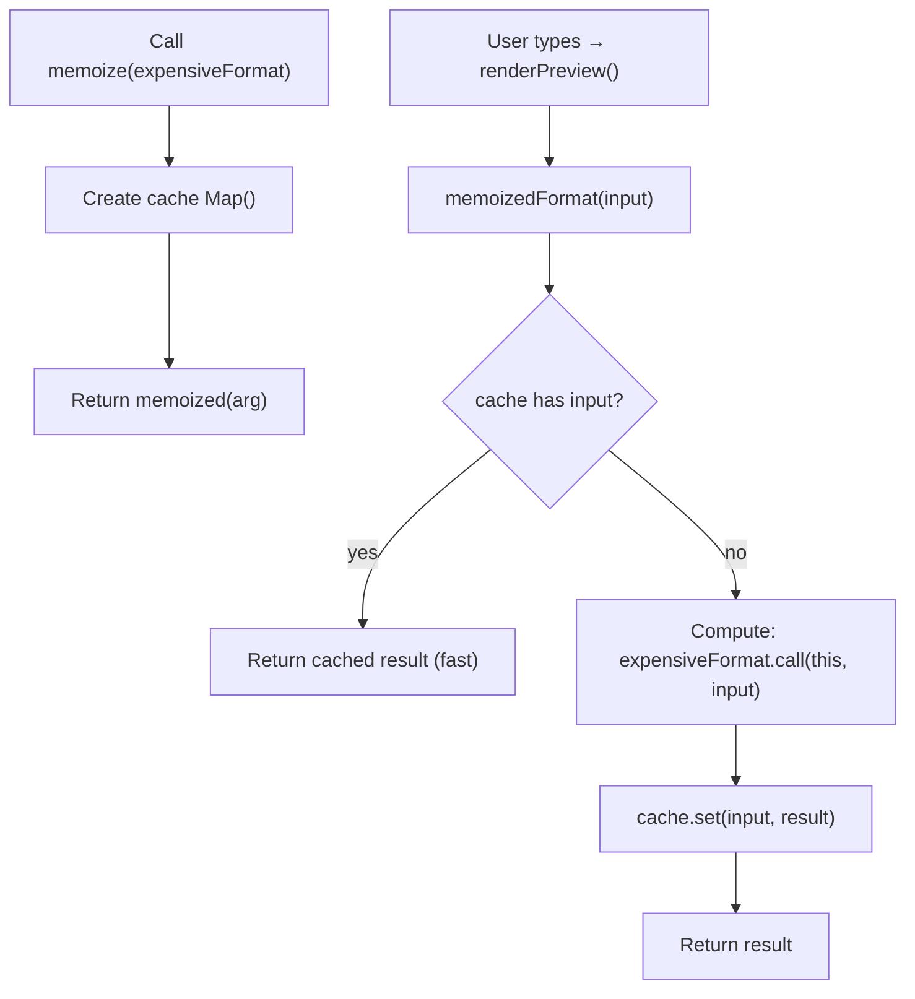

How do you implement `memoize` from scratch (basic → web use case → medium/complex)?
?

`memoize` caches the result of a function call so repeated calls with the “same input” can return instantly.

- best when: deterministic function, same inputs repeat, computation is expensive
- be careful: caching grows memory; “same input” depends on your key strategy

---

## Basic `memoize` key components (what matters)

| Piece | Where it lives | What it’s responsible for |
| --- | --- | --- |
| **Cache store (`Map`)** | inside `memoize`, outside the returned function | Holds `key → result` so repeated calls can return instantly. |
| **Returned wrapper function (`memoized`)** | the function you get back from `memoize(fn)` | This is what you call; it checks the cache first, then falls back to computing. |
| **Cache key** | derived from input (in the basic version: the 1 argument itself) | Defines what “same input” means; if the key strategy is wrong, hits/misses will surprise you. |
| **Hit path (`cache.has/get`)** | early in `memoized(...)` | Fast path: return cached value without running `fn`. |
| **Miss path (compute + store)** | after a cache miss | Call `fn`, store the result under the key, return it. |
| **Forward `this`** | when calling `fn` (`fn.call(this, ...)`) | Preserves method calls so `obj.method` can be memoized safely. |

## Basic `memoize` from scratch (1-arg, primitive key)

This simplest version assumes:

- function takes **one primitive argument** (string/number/boolean)
- the argument itself can be used as a Map key

```js
function memoize(fn) {
  const cache = new Map();

  return function memoized(arg) {
    if (cache.has(arg)) return cache.get(arg);
    const result = fn.call(this, arg);
    cache.set(arg, result);
    return result;
  };
}
```

---

## Walkthrough + simple web app use case (rendering derived data)

Suppose you have an expensive formatting function for a “live preview”.

HTML:

```html
<textarea id="src"></textarea>
<pre id="preview"></pre>
```

JS:

```js
function expensiveFormat(text) {
  // simulate expense
  const end = Date.now() + 25;
  while (Date.now() < end) {}
  return text.trim().toUpperCase();
}

const memoizedFormat = memoize(expensiveFormat);

function renderPreview() {
  const input = document.querySelector("#src").value;
  const output = memoizedFormat(input);
  document.querySelector("#preview").textContent = output;
}

document.querySelector("#src").addEventListener("input", renderPreview);
```

### Flow diagram: what happens on a cache hit vs miss



### Linear timeline: cache misses → then hits when inputs repeat

Example: user types, then undoes back to a previous string.

```text
time:     t0        t1         t2         t3         t4
input:    "h"       "he"       "hel"      "he"       "hel"

cache:    miss      miss       miss       HIT        HIT
work:     run fn    run fn     run fn     (skip)     (skip)
```

### What memoization changes

- Without memoization, `expensiveFormat` runs on every input event.
- With memoization, if the user toggles between the same few strings (undo/redo, copy/paste), repeats can return instantly.

---

## Practical frontend examples (DOM + fetch)

### Example 1: memoize “derived render data” (DOM-friendly)

Common pattern: take raw text/data and compute a **derived view model** used to update the DOM. If the same input repeats (undo/redo, toggling tabs, rerendering), memoization can skip the expensive compute.

```js
function buildPreviewModel(markdown) {
  // pretend this is expensive: parse, sanitize, build token list, etc.
  const tokens = markdown.trim().split(/\s+/);
  return {
    wordCount: tokens.length,
    first10: tokens.slice(0, 10).join(" "),
  };
}

const getPreviewModel = memoize(buildPreviewModel);

function renderPreview(markdown) {
  const model = getPreviewModel(markdown);
  document.querySelector("#preview").textContent =
    `Words: ${model.wordCount}\nPreview: ${model.first10}`;
}
```

When this helps:

- repeated inputs (undo/redo, switching between the same documents, rerenders with unchanged text)
- derived computation is expensive relative to DOM update

### Example 2: memoize fetch by caching the returned Promise (request de-dupe)

If your function returns a Promise, basic `memoize` will cache that Promise. That means multiple callers can share **one in-flight request**.

```js
const fetchUser = memoize(async (id) => {
  const res = await fetch(`/api/users/${id}`);
  if (!res.ok) throw new Error("Failed to fetch user");
  return res.json();
});

// These share one request (same id → same cached Promise):
const a = fetchUser(123);
const b = fetchUser(123);
await Promise.all([a, b]);
```

Two practical caveats:

- **Cache invalidation**: if user 123 changes, you need a way to clear/delete the cache entry (or add a TTL / version key).
- **Errors**: if the cached Promise rejects, you often want to remove it so the next call can retry (that behavior requires an “advanced” memoize that deletes on rejection).

---

## Extending the basic `memoize`: what the “advanced” APIs are for (no code)

The basic version answers: “**for one primitive argument, return cached results when the same value repeats**.”

Real memoization gets more complex because you often need to define what “same input” means and manage memory.

### Feature summary + when it’s useful

- **Multiple arguments support**: cache based on all inputs, not just one.
  - **Useful when**: `fn(a, b, c)` is expensive and the *same combinations* repeat.

- **`resolver(...args) → key`**: a function that turns arguments into a stable cache key.
  - **Useful when**: your args aren’t primitives, or you need a consistent key (e.g., `(userId, page)` → `"123|2"`).
  - **Why it matters**: the resolver defines the meaning of “same input.”

- **Cache controls (`clear`, `delete`, `maxSize`/eviction)**: keep memoization from growing forever.
  - **Useful when**: inputs are unbounded (user typing lots of unique strings, many IDs, many combinations).
  - **Why it’s more robust**: it prevents “memory keeps growing” and gives you an escape hatch in app lifecycles.

- **Async Promise de-dupe (“cache in-flight work”)**: cache the Promise so concurrent callers share one request/compute.
  - **Useful when**: 5 parts of the app ask for the same resource at the same time (fetch user 123, load config, compute expensive data).
  - **Why it’s more robust**: it avoids duplicate in-flight work and lets callers “join” the same result.
  - **Common behavior**: if the Promise rejects, you often remove it from cache so a later call can retry.

### What use cases is the complexity for?

- **Correctness of “same input”**: objects/arrays need a stable key strategy (resolver), otherwise caching will be unreliable.
- **Performance under repeated calls**: multi-arg + resolver supports more real function shapes than the 1-arg toy version.
- **Memory/lifecycle safety**: cache controls help you avoid runaway memory and stale caches.
- **Network and async efficiency**: Promise de-dupe prevents “thundering herd” duplicate requests.
