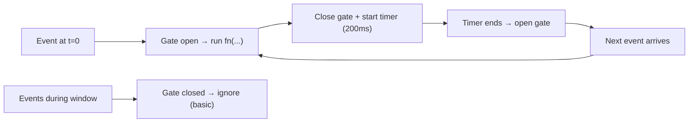

How do you implement `throttle` from scratch (basic → web use case → medium/complex)?
?

`throttle` limits how often a function can run.

- `throttle`: “run at most once every N ms”
- common uses: scroll/resize handlers, mousemove tracking, “rate limit” UI events

## Basic `throttle` key components (what matters)

| Piece | Where it lives | What it’s responsible for |
| --- | --- | --- |
| **Closure state (`inThrottle`)** | inside `throttle`, outside the returned function | A shared boolean “gate” that tracks whether you’re currently inside a throttle window. |
| **Returned wrapper function (`throttled`)** | the function you get back from `throttle(...)` | This is what you call repeatedly; it decides whether `fn` is allowed to run right now. |
| **Gate check (early return)** | at the start of each `throttled(...)` call | Drops calls that arrive while the gate is closed (inside the current window). |
| **Leading-edge run** | inside `throttled(...)` right after passing the gate | In the basic version, the *first* call in a window runs immediately. |
| **Window timer (`setTimeout`)** | after the leading run | Re-opens the gate after `waitMs` so another call can run. |
| **Forward `this` + args (`fn.apply(this, args)`)** | when invoking `fn` | Preserves method calls and arguments, which matters for event handlers and object methods. |

---

## Basic `throttle` from scratch (leading only)

This simplest version runs immediately, then ignores calls until the window ends.

```js
function throttle(fn, waitMs) {
  let inThrottle = false;

  return function throttled(...args) {
    if (inThrottle) return;

    fn.apply(this, args);
    inThrottle = true;

    setTimeout(() => {
      inThrottle = false;
    }, waitMs);
  };
}
```

Key idea: `inThrottle` is the “gate”.

---

## Walkthrough + simple web app use case (scroll handler)

HTML:

```html
<div id="meter" style="position:fixed;top:12px;left:12px"></div>
<div style="height:3000px"></div>
```

JS (update a little UI meter, but not on every scroll event):

```js
function setText(t) {
  document.querySelector("#meter").textContent = t;
}

function reportScroll() {
  setText(`scrollY=${window.scrollY} at ${new Date().toLocaleTimeString()}`);
}

const throttledReport = throttle(reportScroll, 200);
window.addEventListener("scroll", throttledReport, { passive: true });
```

Even if the browser fires dozens of scroll events per second, `reportScroll` runs about once every 200ms.

---

## Step-by-step: what `throttle` does over time (basic version)

Think of throttling as a **gate that can open at most once per window**:

1. **First event arrives (gate open)** → allow `fn(...)` to run immediately.
2. **Close the gate** for the next `waitMs`.
3. **More events arrive while closed** → drop them (basic version).
4. **Timer ends** → re-open the gate.
5. **Next event after the window** becomes the next allowed call, repeating the cycle.

### Timing diagram (example with `waitMs = 200`)

If events fire at \(t = 0, 50, 100, 150, 250, 260\):

- \(t=0\): runs (opens a new window \([0..200)\))
- \(t=50,100,150\): ignored (still inside window)
- \(t=250\): runs (new window \([250..450)\))
- \(t=260\): ignored



### Linear timeline: when `inThrottle` flips `false → true → false`

Same example (\(waitMs = 200\), events at \(t = 0, 50, 100, 150, 250, 260\)):

```text
time (ms):   0       50      100     150     200     250     260     450
             |-------|-------|-------|-------|-------|-------|-------|
event:       ^       ^       ^       ^               ^       ^
             run     drop    drop    drop            run     drop

inThrottle:  false → true -------------------→ false → true --------→ false
             (set true after run)             (timer ends) (new run) (timer ends)
```

---

## Extending the basic `throttle`: what the “advanced” API is for (no code)

The basic version answers: “**run at most once every N ms** (and drop everything in-between).”

More robust throttles add knobs so you can control *which* calls you keep.

### Advanced API summary + when it’s useful

- **`leading`**: run immediately at the start of a window (basic throttle behavior).
  - **Useful when**: you want immediate feedback (UI meter updates, showing something is happening).

- **`trailing`**: run once at the end of the window using the **latest** arguments seen during the window.
  - **Useful when**: you don’t want to lose the “final state” (e.g., send the last mouse position, last scroll position, last resize dimensions).

- **`.cancel()`**: drop any pending trailing run and clear the window.
  - **Useful when**: the work is no longer relevant (unmount, route change, user toggled a mode off).

- **`.flush()`**: run the pending trailing call immediately (if one is queued).
  - **Useful when**: you’re about to commit/submit/navigate and want the most recent throttled state applied right now.

### Why this is more robust

The “advanced” complexity is about **not losing important state**:

- Basic throttle can miss the latest value because it drops calls inside the window.
- Trailing-enabled throttle gives you **periodic updates** *and* the **latest value at the end** of each window.
